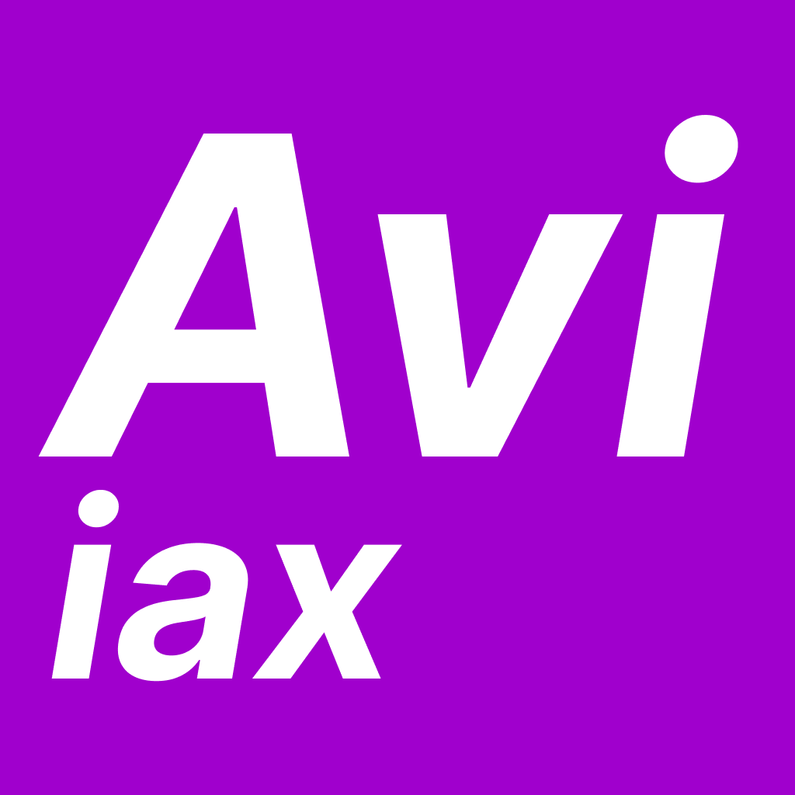

# interAxia4
**Disponible:**

 < Avisos

**Beta:**

 < Control

**Alpha:**

 < Hablar (email)

---

**interAxia4** es una plataforma web integral de coordinación del aula que permite la gestión de dispositivos, notificaciones y actividades diarias en entornos educativos.

## 🚀 Características Principales

### 📱 iControl (Servidor Web)
- **Panel de control web** con interfaz intuitiva en español
- **Gestión de dispositivos** con sistema de registro y administración
- **Sistema de notificaciones** via ntfy.sh con diferentes niveles de prioridad
- **Resumen diario** con integración de calendarios iCal
- **Información del sistema** accesible con easter egg (4 clics en el logo)
- **Gestión de inventario y menú del comedor** (en desarrollo)
- **Base de datos JSON** incorporada para persistencia de datos

### 📢 iAvisos (Cliente de Notificaciones)
- **Cliente de escritorio** para recibir notificaciones en tiempo real
- **Integración con ntfy.sh** para notificaciones push
- **Ventanas emergentes** con diferentes niveles de prioridad
- **Sistema de sonidos** diferenciados según la urgencia
- **Icono en bandeja del sistema** con indicadores de estado
- **Configuración automática** mediante interfaz gráfica

## 🛠️ Tecnologías Utilizadas

### Backend
- **Python 3.11+**
- **Flask** - Framework web
- **Flask-SocketIO** - Comunicación en tiempo real
- **Requests** - Cliente HTTP
- **iCalendar** - Procesamiento de calendarios
- **Axia4** - Backend original

### Frontend
- **Bootstrap 5** con tema Spacelab
- **Font Awesome** - Iconografía
- **HTML5/CSS3/JavaScript**
- **Responsive Design**

### Cliente de Escritorio
- **Tkinter** - Interfaz gráfica
- **Pystray** - Icono en bandeja del sistema
- **PIL (Pillow)** - Procesamiento de imágenes
- **Playsound** - Reproducción de audio

### Despliegue
- **PyInstaller** - Empaquetado de executables
- **GitHub Actions** - CI/CD automatizado

## 📋 Requisitos del Sistema

- **Python 3.11** o superior
- **Windows** (optimizado para entornos Windows)
- **Conexión a internet** para ntfy.sh y calendarios iCal

## 🔧 Instalación y Configuración

### Instalación desde código fuente

1. **Clona el repositorio:**
```bash
git clone https://github.com/Axia4/iControl.git
cd iControl
```

2. **Instala las dependencias:**
```bash
pip install -r requirements.txt
```

3. **Ejecuta iControl (servidor web):**
```bash
cd iControl
python main.py
```

4. **Ejecuta iAvisos (cliente de notificaciones):**
```bash
cd iAvisos
python main.py
```

### Instalación desde ejecutables

1. Descarga los ejecutables desde [Releases](https://github.com/Axia4/iControl/releases)
2. Ejecuta `iControl.exe` para el servidor web
3. Ejecuta `iAvisos.exe` para el cliente de notificaciones

## ⚙️ Configuración

### iControl (Servidor Web)

El servidor se ejecuta por defecto en:
- **Desarrollo:** `http://localhost:5000`
- **Producción:** `http://0.0.0.0:5343`

**Configuración de calendarios:** Edita `_datos/iControl.config`:
```json
{
  "Cal_TurnosDeTarde": "https://calendar.google.com/calendar/ical/...",
  "Cal_Recordatorios": "https://calendar.google.com/calendar/ical/..."
}
```

### iAvisos (Cliente)

Al primera ejecución, se solicitará:
- **Topic de ntfy.sh:** Canal único para recibir notificaciones
- **URL de iControl:** Dirección del servidor web

La configuración se guarda en `~/iaxconfig.avisos.json`

## 📖 Uso

### Gestión de Dispositivos
1. Accede a **Administración → Dispositivos**
2. Registra nuevos dispositivos con sus topics de ntfy.sh
3. Gestiona permisos y descripciones

### Envío de Notificaciones
1. Ve a **Administración → Enviar aviso**
2. Selecciona dispositivos destino
3. Redacta el mensaje y establece la prioridad
4. Envía la notificación

### Niveles de Prioridad
- **1 - Solo PCs:** Notificaciones básicas
- **2 - Baja:** Color verde
- **3 - Normal:** Color blanco (por defecto)
- **4 - Prioritaria:** Color naranja
- **5 - Urgente:** Color rojo con alarma sonora

### Resumen Diario
- **Menú del comedor:** Información nutricional diaria
- **Recordatorios:** Eventos del calendario de recordatorios
- **Turnos de tarde:** Horarios y actividades vespertinas
- **Cambios en inventario:** Actualizaciones de stock

## 🔧 Desarrollo

### Estructura del Proyecto
```
iControl/
├── iControl/           # Servidor web Flask
│   ├── main.py        # Aplicación principal
│   ├── templates/     # Plantillas HTML
│   ├── static/        # Recursos estáticos
│   └── iaxshared/     # Módulos compartidos
│       ├── iax_db.py  # Base de datos JSON
│       └── notify.py  # Sistema de notificaciones
├── iAvisos/           # Cliente de notificaciones
│   ├── main.py        # Aplicación principal
│   └── static/        # Recursos (iconos, sonidos)
├── requirements.txt   # Dependencias Python
└── .github/workflows/ # CI/CD
```

### Comandos de Desarrollo

**Modo desarrollo:**
```bash
cd iControl
python main.py --dev
```

**Construcción de ejecutables:**
```bash
# iControl
pyinstaller --onefile --icon=iControl/logo.ico --add-data "iControl/static;static" --add-data "iControl/templates;templates" -n iControl iControl/main.py

# iAvisos  
pyinstaller --windowed --onefile --icon=iAvisos/logo.ico --add-data "iAvisos/static;static" -n iAvisos iAvisos/main.py
```

## 🤝 Contribución

1. Fork el proyecto
2. Crea una rama para tu característica (`git checkout -b feature/nueva-caracteristica`)
3. Commit tus cambios (`git commit -am 'Añadir nueva característica'`)
4. Push a la rama (`git push origin feature/nueva-caracteristica`)
5. Abre un Pull Request

## 📄 Licencia

Este proyecto está bajo la Licencia MIT. Ver el archivo `LICENSE` para más detalles.

## 🐛 Reportar Problemas

Si encuentras algún problema o tienes sugerencias, por favor abre un [Issue](https://github.com/Axia4/iControl/issues) en GitHub.

## 📧 Contacto

- **Repositorio:** [github.com/Axia4/iControl](https://github.com/Axia4/iControl)
- **Desarrollador:** EuskadiTech (tech.eus)

---

**interAxia4** - Conectando aulas, coordinando aprendizaje 🎓
